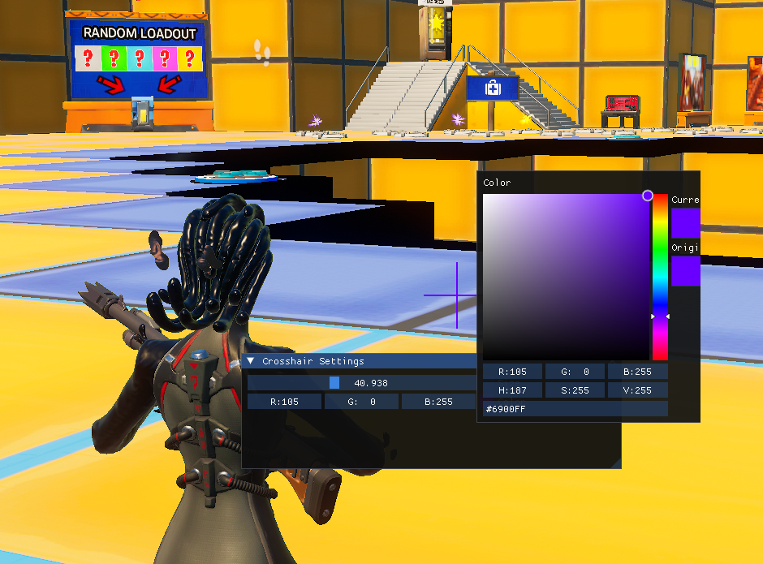

# simplCrosshair

**simplCrosshair** is a simple C++ crosshair overlay application that uses **OpenGL** and [ImGui](https://github.com/ocornut/imgui) to render customizable crosshairs on top of any windowed/windowedFullscreen game.

To customize the crosshair press [ while windows is focused on simplCrosshair (you can use alt+tab) and an [imgui](https://github.com/ocornut/imgui) window will open, for further customization modify the source code yourself

By using simplCrosshair, you acknowledge that you are fully responsible for any (rarely possible) game bans, account suspensions, or other consequences that may arise from using this software.
